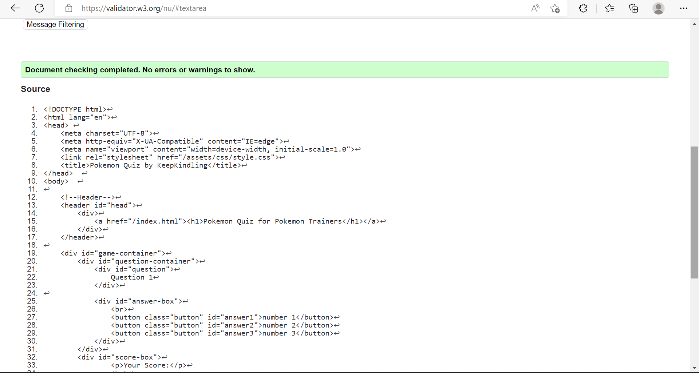
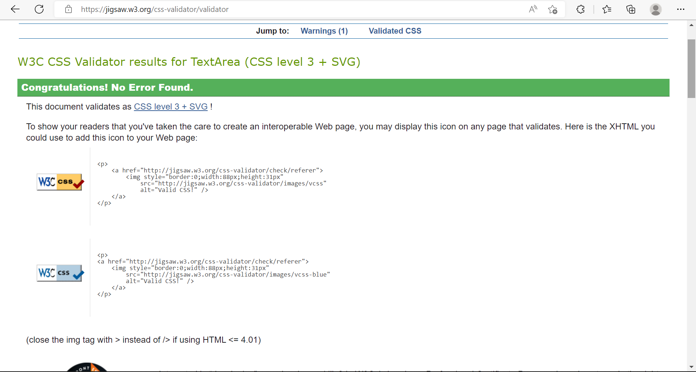
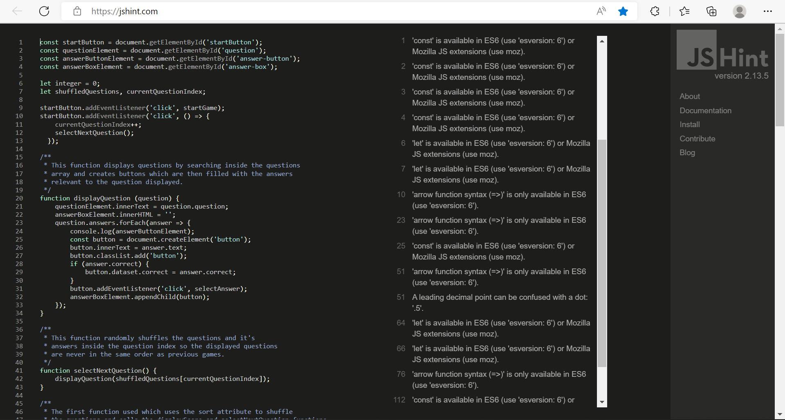

# Pokemon Quiz

# Project Overview

A quiz is a great way to test your knowledge on any given subject and is fun to play with or against others. Even today people still enjoy a simple quiz every now and then.

The purpose of this project is to provide a short but fun game for any pokemon fan. Novice or veteran as it houses very simple questions that most people could probably guess the answer to.

Having a scoreboard and a running timer gives a little competetive aspect to this quiz though allowing more people to come together to play it therefore increasing the potential user base.

## Site Goals 

The main goals of this site are to: 

- Provide a fun game to pass the time
- Allow users to test their knowledge of the quiz topic
- Casually learn about the first Pokemon anime
- Spark an interest in the original Pokemon anime
- play competetively with friends and family

# Features

# Main Page

## Header

- The largest part of the site and it's pages
- designed to be kid friendly and easy to read
- Name of the game always present
- Acts as a link to the first page to allow users to remind themselves of the rule's

## Rules

- This section is short and to the point for user experience
- Uses an easy to read font for the user
- has a darker background colour as to make the information stand out and not clash with the page background
- It's sectioned to explain each part of the game and it's object's
- Has a start game link at the bottom that takes user's to the game page

## Page's background

- Used a background generator website to custom build an appropriate and visually pleasing background with light colours
- Used circles in the image to create a smooth feel to the site

# Game page

## Question section

The questions section will automatically display a question that is randomly picked for the user to answer. It Uses black font as to be easily interpreted and discernable by the user. Has a slightly larger text to add to this aswell. I decided the page would look too cluttered if I gave it a background so left it alone. The questions are inside of an array and are randomly selected using the Math.random() attribute.

## Answer's section

This box holds the different answer's that the user may pick from when making a decision. There are always three to choose from. The answers are inside of buttons that have been styled to have a white outline and a brown background as it fit's the color scheme and doesn't take away from the user's visual representation of the site. The correct answer will move randomly between these buttons so user's can't pick the same button for every question making an easy quiz.

## Score section

This small container is located underneath the answers container at the bottom of the screen and 
keep's a record of how many questions the user has gotten correct out of /10. It utilizes the same colour's as the answer boxes but instead has a border of gold to keep them seperated. This way the user can easily discern they are different.

## Restart Game button

This last feature is at the bottom of the game page and when pressed, reverts the score to 0/10 and shuffles the questions again. The text is white while the background and border are brown and gold.

# page design

## Colour Scheme

The site uses 6 overall colours but only 4 are for the general theme of the site. The colours are white, black, gold, brown = d47516#, red and green. White and black are used as easily distinguishable text amoung brown and gold background's. I chose yo use gold and brown as the bulk colour of the site as they are playful and are appropriate for catching the attention of children.
Red is used to highlight an incorrect answer and green for a correct answer.

## Layout

I decided the main page would benefit from housing the rule's of the game so they are instantly accessable by the user. It's big and clear to read. The small button at the bottom cant be missed because its the only other thing on the landing page.

The header is always in view and acts as a link to the landing page in case the user would like to get a refresher of the rules, but as it's a very simplistic game, It may not be used as often.

For the second page, each section spans the entire width of the window. I gave the answers container div smooth corners and a light coloured background so the answers would be the main focus using dark colours and white borders.

## Technologie's Used

- HTML5
- CSS3
- JavaScript
- Google Fonts
- Git
- Github

# Testing 

## Validator Testing

I used the W3C Markup Validation Service to test my HTML code for my project and had no errors fortunately.

- HTML Validation

I used the W3C CSS Validation Service to test all CSS in my stylesheet and also came up with no errors.

- CSS Validation

 

I used the website JSHint.com to check my javascript code and came up with no issues, only warning's that arent relevant to the actual code functioning properly

- JavaScript Validation

## Further Testing

- I have tested all anchor links and they work properly with no bug's
- I have pressed all buttons on both page's and they work correctly

